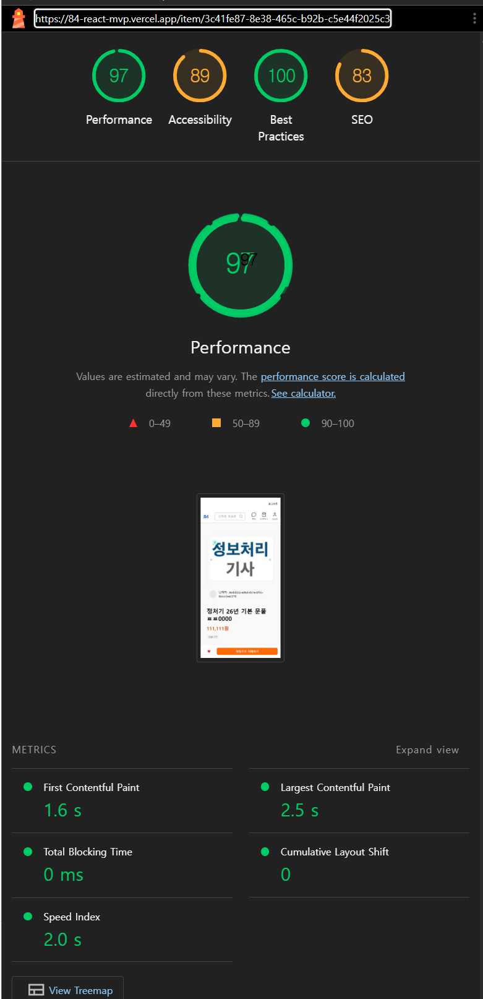
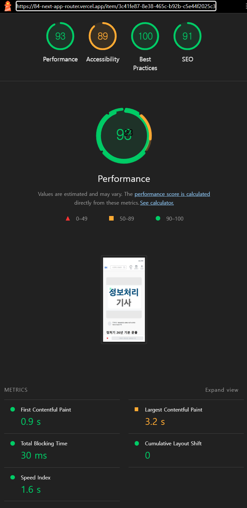
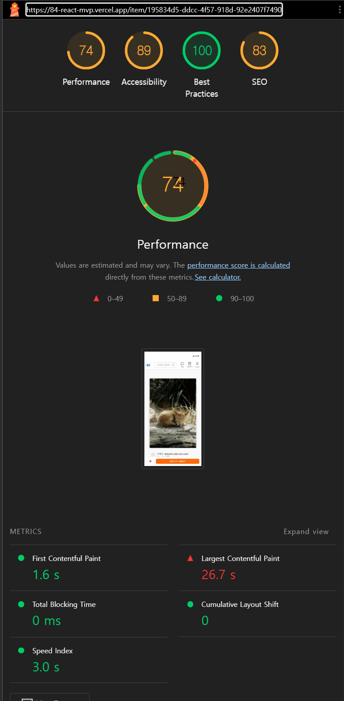
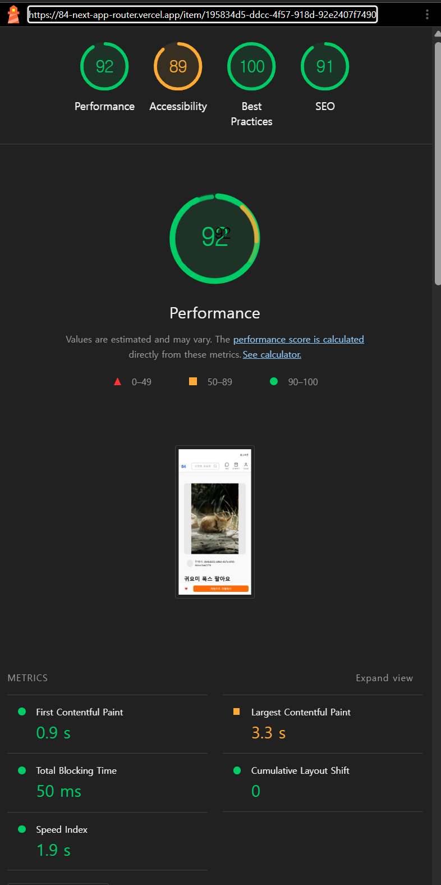
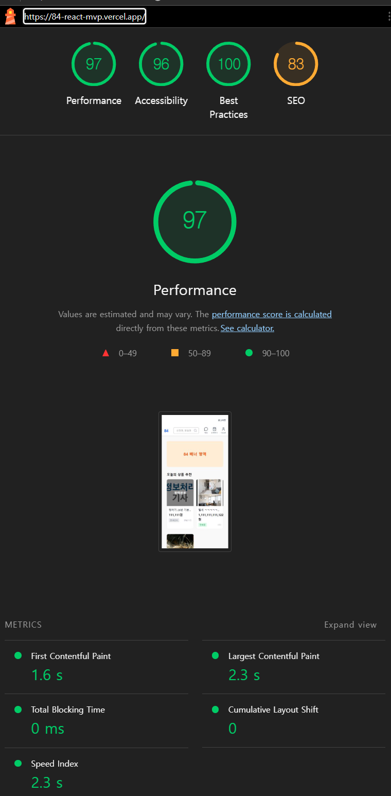
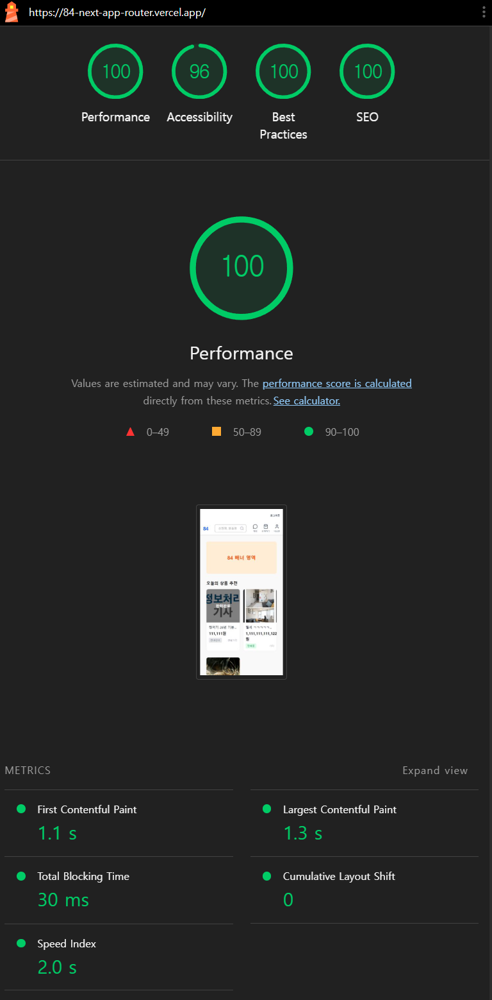

# v2/v3 Lighthouse 비교

## 측정 목적

React SPA 기반 v2와 Next.js App Router 기반 v3의 상품 상세 페이지 초기 렌더링을 비교한다.
동일한 Supabase 상품 데이터를 사용하되 이미지 원본 크기에 따른 영향을 구분하기 위해 일반 이미지와 대용량 이미지 상품을 각각 측정했다.

홈 화면도 같은 조건에서 별도로 측정해, 첫 페이지 데이터를 클라이언트 조회 후 렌더링하는 v2와 서버에서 렌더링하는 v3의 초기 진입 결과를 보조 표본으로 기록했다.

이 측정은 프레임워크만을 독립적으로 비교하는 실험이 아니다. v3에는 Server Component 초기 조회, `next/image`, 태그 기반 캐시가 함께 반영되어 있으므로 각 지표의 원인을 구현 차이와 함께 해석한다.

측정 대상 v3는 Supabase SSR Auth 전환까지 완료된 최종 배포 버전이다. 다만 SSR Auth는 서버 신뢰 경계와 권한 검증을 개선한 작업이므로 Lighthouse 성능 결과의 원인으로 해석하지 않는다.

## 측정 환경

- 측정 일시: 2026-08-06
- 측정 도구: Chrome DevTools Lighthouse 13.3.0
- 측정 모드: Navigation, Mobile
- 에뮬레이션: Moto G Power, Slow 4G throttling
- 측정 상태: 시크릿 창, 비로그인 상태, initial page load
- 측정 횟수: 일반 이미지 상세, 대용량 이미지 상세, 홈 화면마다 v2 5회, v3 5회
- v3 기준: `perf-after-auth-migration` 태그 (`81c8154`)

### 일반 이미지 상품

- 상품 ID: `3c41fe87-8e38-465c-b92b-c5e44f2025c3`
- v2: `https://84-react-mvp.vercel.app/item/3c41fe87-8e38-465c-b92b-c5e44f2025c3`
- v3: `https://84-next-app-router.vercel.app/item/3c41fe87-8e38-465c-b92b-c5e44f2025c3`

### 대용량 이미지 상품

- 상품 ID: `195834d5-ddcc-4f57-918d-92e2407f7490`
- v2: `https://84-react-mvp.vercel.app/item/195834d5-ddcc-4f57-918d-92e2407f7490`
- v3: `https://84-next-app-router.vercel.app/item/195834d5-ddcc-4f57-918d-92e2407f7490`

### 홈 화면

- v2: `https://84-react-mvp.vercel.app/`
- v3: `https://84-next-app-router.vercel.app/`
- 첫 페이지 조회 상한: 두 버전 모두 `created_at` 내림차순 최대 5개
- 측정 당시 실제 상품 수: 3개

## 대표 측정 화면

### 일반 이미지 상품

| v2 React SPA | v3 Next App Router |
| --- | --- |
|  |  |

### 대용량 이미지 상품

| v2 React SPA | v3 Next App Router |
| --- | --- |
|  |  |

### 홈 화면

| v2 React SPA | v3 Next App Router |
| --- | --- |
|  |  |

## 일반 이미지 측정 결과

### v2 React SPA

| 회차 | Performance | FCP | LCP | TBT | Speed Index | CLS |
| ---: | ---: | ---: | ---: | ---: | ---: | ---: |
| 1 | 96 | 1.7s | 2.5s | 0ms | 2.2s | 0 |
| 2 | 98 | 1.6s | 2.2s | 0ms | 2.1s | 0 |
| 3 | 98 | 1.6s | 2.2s | 0ms | 1.9s | 0 |
| 4 | 97 | 1.6s | 2.5s | 0ms | 2.0s | 0 |
| 5 | 97 | 1.6s | 2.5s | 0ms | 2.0s | 0 |
| 평균 | 97.2 | 1.62s | 2.38s | 0ms | 2.04s | 0 |
| 중앙값 | 97 | 1.6s | 2.5s | 0ms | 2.0s | 0 |

### v3 Next App Router

| 회차 | Performance | FCP | LCP | TBT | Speed Index | CLS |
| ---: | ---: | ---: | ---: | ---: | ---: | ---: |
| 1 | 92 | 0.9s | 2.4s | 40ms | 6.1s | 0 |
| 2 | 90 | 1.2s | 3.2s | 120ms | 3.9s | 0 |
| 3 | 93 | 0.9s | 3.2s | 20ms | 1.4s | 0.006 |
| 4 | 93 | 0.9s | 3.2s | 40ms | 1.9s | 0 |
| 5 | 93 | 0.9s | 3.2s | 30ms | 1.6s | 0 |
| 평균 | 92.2 | 0.96s | 3.04s | 50ms | 2.98s | 0.0012 |
| 중앙값 | 93 | 0.9s | 3.2s | 40ms | 1.9s | 0 |

## 대용량 이미지 측정 결과

### v2 React SPA

| 회차 | Performance | FCP | LCP | TBT | Speed Index | CLS |
| ---: | ---: | ---: | ---: | ---: | ---: | ---: |
| 1 | 74 | 1.6s | 26.6s | 0ms | 2.8s | 0 |
| 2 | 74 | 1.6s | 27.0s | 0ms | 3.2s | 0 |
| 3 | 74 | 1.6s | 26.7s | 0ms | 3.0s | 0 |
| 4 | 74 | 1.6s | 26.6s | 0ms | 2.8s | 0 |
| 5 | 74 | 1.6s | 27.0s | 0ms | 3.2s | 0 |
| 평균 | 74.0 | 1.60s | 26.78s | 0ms | 3.00s | 0 |
| 중앙값 | 74 | 1.6s | 26.7s | 0ms | 3.0s | 0 |

### v3 Next App Router

| 회차 | Performance | FCP | LCP | TBT | Speed Index | CLS |
| ---: | ---: | ---: | ---: | ---: | ---: | ---: |
| 1 | 99 | 0.9s | 1.8s | 70ms | 1.5s | 0.005 |
| 2 | 92 | 0.9s | 3.3s | 70ms | 2.0s | 0 |
| 3 | 92 | 1.0s | 3.4s | 30ms | 1.9s | 0 |
| 4 | 92 | 0.9s | 3.3s | 50ms | 1.7s | 0 |
| 5 | 92 | 0.9s | 3.3s | 50ms | 1.9s | 0 |
| 평균 | 93.4 | 0.92s | 3.02s | 54ms | 1.80s | 0.001 |
| 중앙값 | 92 | 0.9s | 3.3s | 50ms | 1.9s | 0 |

## 홈 화면 측정 결과

### v2 React SPA

| 회차 | Performance | FCP | LCP | TBT | Speed Index | CLS |
| ---: | ---: | ---: | ---: | ---: | ---: | ---: |
| 1 | 97 | 1.8s | 2.4s | 10ms | 2.4s | 0 |
| 2 | 97 | 1.6s | 2.3s | 0ms | 2.4s | 0 |
| 3 | 98 | 1.6s | 2.3s | 0ms | 2.2s | 0 |
| 4 | 97 | 1.6s | 2.3s | 0ms | 2.3s | 0 |
| 5 | 98 | 1.6s | 2.3s | 0ms | 2.1s | 0 |
| 평균 | 97.4 | 1.64s | 2.32s | 2ms | 2.28s | 0 |
| 중앙값 | 97 | 1.6s | 2.3s | 0ms | 2.3s | 0 |

### v3 Next App Router

| 회차 | Performance | FCP | LCP | TBT | Speed Index | CLS |
| ---: | ---: | ---: | ---: | ---: | ---: | ---: |
| 1 | 98 | 1.2s | 1.8s | 120ms | 2.1s | 0 |
| 2 | 100 | 0.9s | 1.1s | 20ms | 1.2s | 0 |
| 3 | 100 | 1.1s | 1.3s | 30ms | 2.0s | 0 |
| 4 | 98 | 1.0s | 2.3s | 20ms | 1.4s | 0 |
| 5 | 100 | 1.0s | 1.1s | 20ms | 1.0s | 0.004 |
| 평균 | 99.2 | 1.04s | 1.52s | 42ms | 1.54s | 0.0008 |
| 중앙값 | 100 | 1.0s | 1.3s | 20ms | 1.4s | 0 |

## 중앙값 비교

| 이미지 조건 | 지표 | v2 React | v3 Next | 변화 |
| --- | --- | ---: | ---: | ---: |
| 일반 | Performance | 97 | 93 | -4점 |
| 일반 | FCP | 1.6s | 0.9s | 약 43.8% 단축 |
| 일반 | LCP | 2.5s | 3.2s | 약 28.0% 증가 |
| 일반 | TBT | 0ms | 40ms | 증가 |
| 일반 | Speed Index | 2.0s | 1.9s | 약 5.0% 단축 |
| 대용량 | Performance | 74 | 92 | +18점 |
| 대용량 | FCP | 1.6s | 0.9s | 약 43.8% 단축 |
| 대용량 | LCP | 26.7s | 3.3s | 약 87.6% 단축 |
| 대용량 | TBT | 0ms | 50ms | 증가 |
| 대용량 | Speed Index | 3.0s | 1.9s | 약 36.7% 단축 |
| 홈 | Performance | 97 | 100 | +3점 |
| 홈 | FCP | 1.6s | 1.0s | 약 37.5% 단축 |
| 홈 | LCP | 2.3s | 1.3s | 약 43.5% 단축 |
| 홈 | TBT | 0ms | 20ms | 증가 |
| 홈 | Speed Index | 2.3s | 1.4s | 약 39.1% 단축 |

## 대용량 이미지 응답 비교

로컬 원본 파일 대신 각 배포 페이지가 실제로 요청한 이미지 응답을 저장해 파일 크기와 브라우저 표시 정보를 확인했다. 아래 크기는 HTTP 헤더를 포함한 DevTools `Transferred` 값이 아니라 다운로드된 이미지 응답 본문의 파일 크기다.

| 항목 | v2 React | v3 Next |
| --- | ---: | ---: |
| 요청 경로 | Supabase Storage 원본 URL | `/_next/image?...&w=1080&q=75` |
| 응답 형식 | JPEG | WebP |
| 응답 파일 크기 | 4,936,503 bytes (4.71 MiB) | 90,860 bytes (88.7 KiB) |
| 응답 이미지 픽셀 크기 | 4000×6000 | 1080×1620 |
| 화면 표시 영역 | 479×500 | 479×500 |

v3 이미지 응답은 v2 원본보다 약 98.2% 작고, 크기 비율로는 약 54.3배 감소했다. 이 결과는 대용량 이미지 조건의 LCP 차이에 `next/image`의 크기·포맷 변환이 크게 기여했다는 해석을 뒷받침한다.

## 품질 감사 결과

| 화면·항목 | v2 React | v3 Next | 해석 |
| --- | ---: | ---: | --- |
| 상품 상세 Accessibility | 89 | 89 | 동일 |
| 상품 상세 Best Practices | 100 | 100 | 동일 |
| 상품 상세 SEO | 83 | 91~100 | v3 측정 시 meta description 감지 여부에 따라 변동 |
| 홈 Accessibility | 96 | 96 | 동일 |
| 홈 Best Practices | 100 | 100 | 동일 |
| 홈 SEO | 83 | 100 | v3 5회 모두 100점 |

v2는 meta description 누락과 유효하지 않은 `robots.txt` 감사로 SEO 83점이 반복됐다. v3는 상품별 `generateMetadata`와 유효한 metadata 응답을 제공하지만, 반복 측정에서 SEO 91점과 100점이 모두 관찰됐다. 91점 실행에서는 Lighthouse가 동적으로 생성된 meta description을 감지하지 못했고 재측정에서는 정상 반영됐다. [Next.js 스트리밍 metadata](https://nextjs.org/docs/app/api-reference/functions/generate-metadata#streaming-metadata) 반영 시점과 Lighthouse 감사 시점 차이의 영향으로 추정하며, Lighthouse 점수를 실제 검색 노출이나 순위 개선으로 해석하지 않는다.

## 해석

### 초기 콘텐츠 표시

두 상품 조건 모두 FCP 중앙값이 1.6s에서 0.9s로 단축됐다. v3는 상품 정보를 클라이언트 요청 이후 렌더링하지 않고 Server Component에서 조회해 초기 응답에 포함한다. 이 구조 변경은 이미지 원본 크기와 관계없이 초기 콘텐츠가 더 일찍 표시된 결과와 함께 설명할 수 있다.

### 이미지 크기에 따른 LCP 차이

대용량 이미지 상품의 LCP 중앙값은 26.7s에서 3.3s로 단축됐다. v2는 Supabase Storage 원본 이미지를 ``로 직접 요청하지만, v3는 `next/image`가 화면 크기에 맞는 파생 이미지를 전달한다. 따라서 이 조건의 큰 LCP 차이는 App Router만의 효과가 아니라 이미지 전송 방식 변경의 영향이 크다.

일반 이미지 상품에서는 LCP 중앙값이 2.5s에서 3.2s로 증가했다. 원본이 이미 작은 경우 이미지 변환의 이점이 줄고, 현재 v3 상세 페이지의 이미지 요청과 렌더링 경로가 상대적으로 드러난다. 이 결과 때문에 모든 상품의 LCP가 개선됐다고 일반화하지 않는다.

### 홈 초기 렌더링

홈 화면은 FCP 중앙값이 1.6s에서 1.0s로, LCP 중앙값이 2.3s에서 1.3s로 단축됐다. v2는 브라우저에서 첫 페이지 상품 쿼리가 끝난 뒤 카드를 렌더링하지만, v3는 같은 조회 범위를 Server Component에서 가져와 초기 응답에 포함한다. 카드 이미지도 원본 ``에서 반응형 `next/image`로 변경됐기 때문에, 이 결과 역시 서버 렌더링만의 효과로 분리하지 않고 두 구현 변화가 함께 반영된 보조 결과로 해석한다.

### TBT와 측정 편차

v3의 TBT는 일반 이미지 중앙값 40ms, 대용량 이미지 중앙값 50ms, 홈 중앙값 20ms로 v2보다 증가했다. 절대값은 낮지만 원인을 별도 추적하지 않은 상태이므로 특정 Provider나 런타임 탓으로 단정하지 않는다. 일반 이미지의 Speed Index 6.1s와 홈의 TBT 120ms처럼 실행 간 편차가 있어 평균과 중앙값을 함께 기록했다.

## 한계

- Lighthouse 실험실 측정이며 실제 사용자 환경의 Core Web Vitals를 의미하지 않는다.
- v2와 v3는 렌더링 방식, 이미지 전달, 번들 및 인증 구조가 함께 달라 단일 요인의 인과 효과를 분리할 수 없다.
- 공개 상품 상세 두 조건과 홈 초기 진입에 한정된 결과이며 마이페이지, 채팅, 로그인 후 상호작용 성능으로 일반화하지 않는다.
- SSR Auth의 주된 성과는 성능보다 서버 신뢰 경계와 권한 검증이므로 Lighthouse로 평가하지 않는다.
